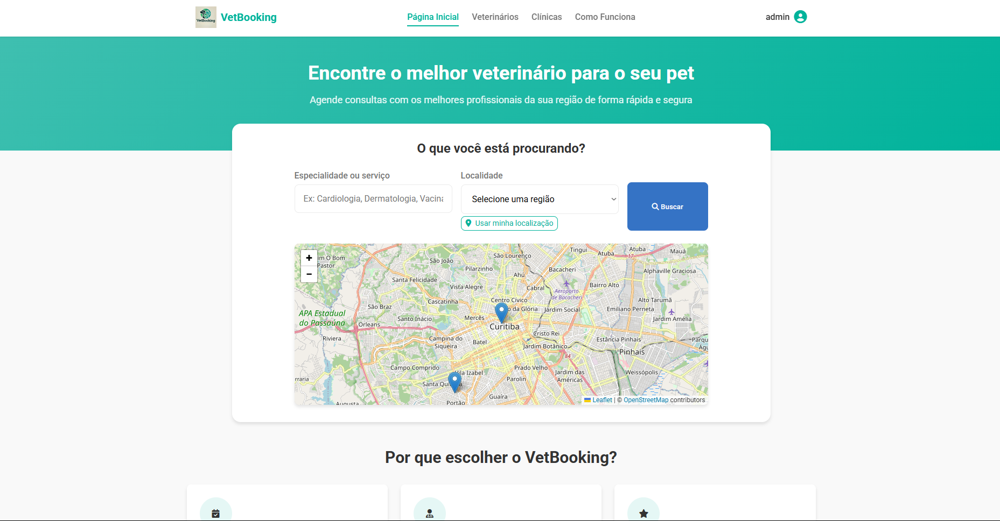
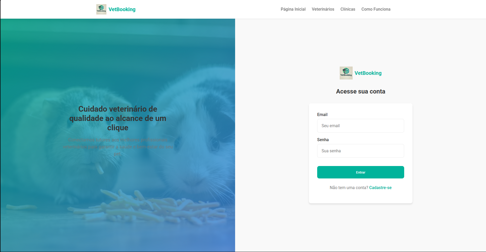
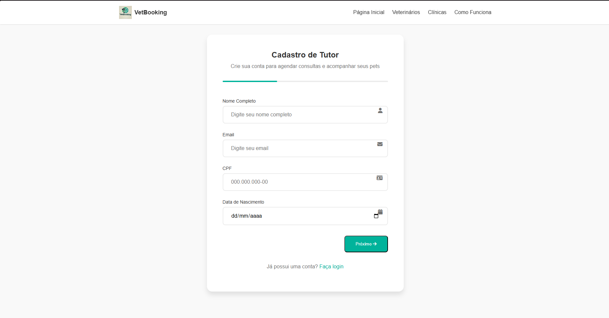
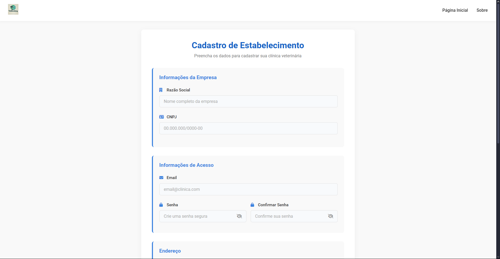
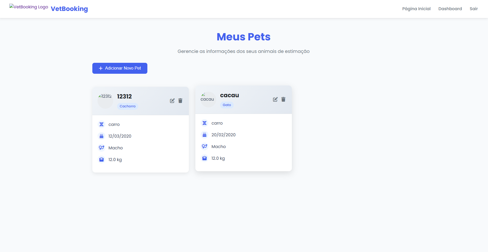

# VetBooking 🐾

.jpeg)

*Conectando tutores às melhores clínicas para cuidar do seu pet*

## 📋 Sobre o Projeto

O PetBooking é uma plataforma inovadora que revoluciona a forma como tutores de animais encontram e agendam serviços para seus pets. Nosso sistema conecta tutores a clínicas de forma intuitiva e eficiente, simplificando o processo de agendamento de consultas e o gerenciamento das informações dos pets.

### 🖥️ Principais Telas do Sistema

#### Acesso e Cadastro
| Página Inicial | Login | Cadastro Tutor |
|----------------|-------|----------------|
|  |  |  |

#### Área Profissional
| Cadastro Clínica | Gerenciamento de Pets |
|------------------|----------------------|
|  |  |

## ⭐ Funcionalidades

### 🌐 Acesso Público
- Exploração do catálogo de clínicas
- Sistema de cadastro para diferentes perfis
- Login seguro e personalizado

### 🐾 Área do Tutor
- Cadastro e gerenciamento completo dos pets
- Busca de clínicas

### 🏥 Área da Clínica
- Perfil institucional completo
- Gestão de serviços oferecidos

## 🔄 Como Funciona

1. **Cadastro e Acesso**
   - Escolha do tipo de perfil (Tutor ou Clínica)
   - Preenchimento de informações específicas
   - Validação e ativação da conta

2. **Utilização do Sistema**
   - Login necessário para funcionalidades específicas
   - Cada perfil possui dashboard personalizado
   - Interface intuitiva e responsiva

3. **Agendamento de Consultas**
   - Tutores pesquisam profissionais/clínicas
   - Seleção de data e horário disponíveis
   - Confirmação automática e notificações

## 🛠️ Tecnologias Utilizadas

### Frontend
- **HTML5** - Estruturação semântica do conteúdo
  - Templates responsivos
  - Acessibilidade integrada
  - SEO otimizado

- **CSS3** - Estilização moderna e responsiva
  - Flexbox e Grid Layout
  - Animações e transições
  - Design adaptativo

- **JavaScript** - Interatividade e dinamismo
  - Validações em tempo real
  - Requisições assíncronas
  - Manipulação do DOM

### Backend
- **Python** - Linguagem principal
  - Código limpo e modular
  - Alta performance
  - Fácil manutenção

- **Flask** - Framework web
  - Rotas REST
  - Gerenciamento de sessões
  - Middleware de autenticação

- **MySQL** - Banco de dados
  - Estrutura relacional otimizada
  - Queries eficientes
  - Backup automático

### Ferramentas de Desenvolvimento
- **Git** - Controle de versão
- **VS Code** - IDE principal
- **Figma** - Design de interface

## 👥 Nossa Equipe

| Membro | Função | Contribuições |
|--------|---------|---------------|
| `Fernando Gomes Monteiro` | Desenvolvedor Fullstack | • Arquitetura do sistema • Desenvolvimento frontend e backend • Integração com banco de dados • Implementação de autenticação |
| `Amanda Miquelissa` | Documentação e Gestão | • Documentação técnica • Gestão do projeto • Controle de qualidade • Edição de conteúdo |
| `Felipe` | Arquiteto de Dados | • Modelagem do banco de dados • Otimização de queries • Segurança de dados • Backup e recuperação |
| `Carlos` | Suporte Técnico | • Suporte ao desenvolvimento • Testes e validação • Resolução de problemas 
